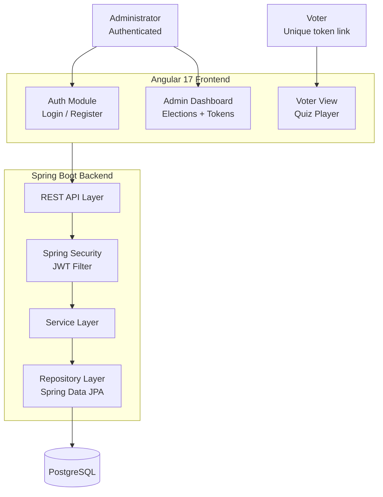
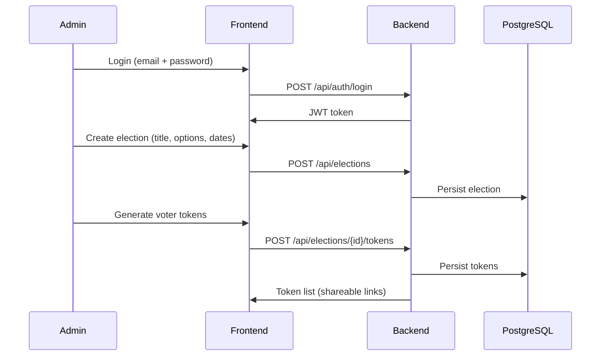
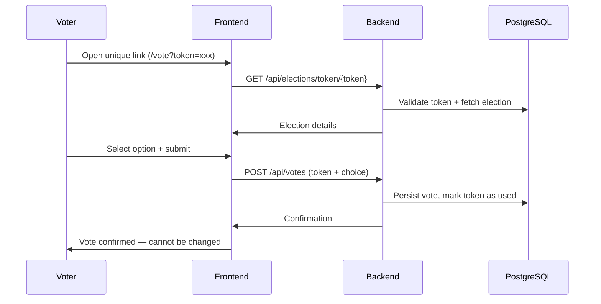
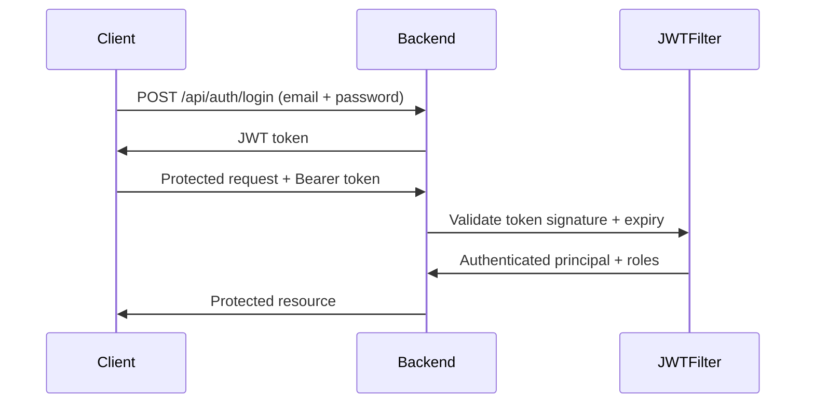
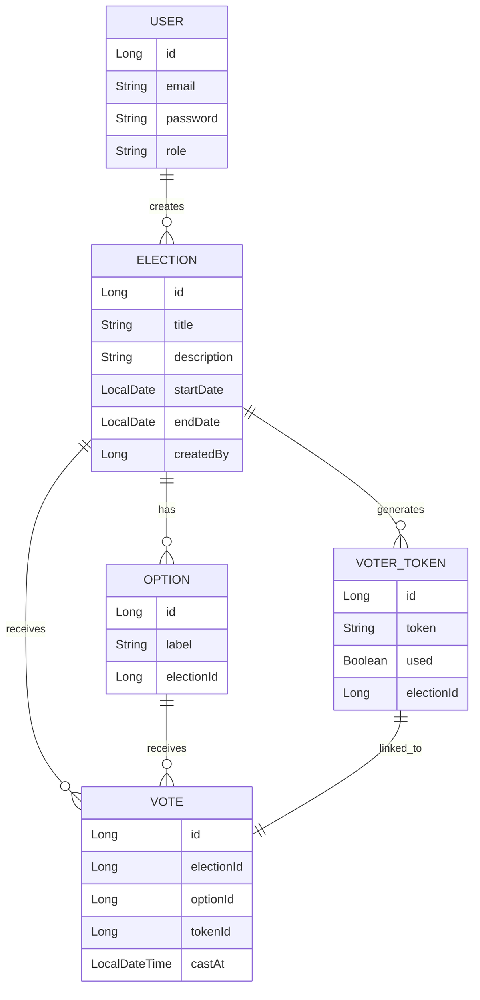

<div align="center">

# 🗳️ eVote

**A modern, secure electronic voting platform.**

eVote allows administrators to create elections, invite voters via unique tokens, and consult results — all through a clean, secure web interface.

[](https://openjdk.org/)
[](https://spring.io/projects/spring-boot)
[](https://angular.io/)
[](https://www.postgresql.org/)
[](https://getbootstrap.com/)
[]()
[]()
[]()

</div>

---

## 📖 Overview

eVote is a full-stack web application for managing secure electronic elections. An administrator creates an election with a title, description, dates, and voting options, then generates unique tokens for each invited voter. Voters access the election through a private link and cast a single, immutable vote. Results are available to the administrator in real time.

---

## ✨ Features

### 👤 Authenticated Administrator
- Create elections with title, description, date range, and voting options
- Generate unique tokens for each voter
- Track participation (voter count vs. votes cast)
- View results per election

### 🗳️ Voter
- Access an election through a unique private link / token
- Cast a single vote — non-editable after submission

### 🔐 Security
- JWT-based authentication
- Role-based access control (ADMIN / USER)
- Angular Route Guards and HTTP Interceptor

---

## 🏗️ Architecture



---

## 🔄 Core Flows

### Election Creation & Voter Invitation



### Voting Flow



---

## 🔐 Authentication

eVote uses stateless **JWT authentication** with role-based access control.



- Token stored in **localStorage** on the frontend
- **HTTP Interceptor** automatically injects the `Authorization: Bearer` header
- **Route Guards** block access to protected Angular routes
- Roles: `ADMIN` (full access) · `USER` (voter-facing views)

---

## 📐 Data Models



---

## 🛠️ Technology Stack

### Backend
| Technology | Role |
|---|---|
| Java 17+ | Runtime |
| Spring Boot 3+ | Application framework |
| Spring Security | JWT authentication + role enforcement |
| Spring Data JPA | Data access layer |
| MapStruct | DTO mapping |
| PostgreSQL | Relational database |
| Maven | Build tool |

### Frontend
| Technology | Role |
|---|---|
| Angular 17 (standalone) | SPA framework |
| Bootstrap 5 | UI components and layout |
| Angular Router + Guards | Navigation and access control |
| HTTP Interceptor | Automatic token injection |
| LocalStorage | JWT token storage |

---

## 🚀 Getting Started

### Prerequisites

- [Java 17+](https://openjdk.org/)
- [Maven](https://maven.apache.org/)
- [Node.js 18+ + Angular CLI](https://nodejs.org/)
- [PostgreSQL](https://www.postgresql.org/)

### Backend

**1. Configure the database and JWT secret**

Create `src/main/resources/application.properties`:

```properties
spring.datasource.url=jdbc:postgresql://localhost:5432/evote
spring.datasource.username=postgres
spring.datasource.password=yourpassword

spring.jpa.hibernate.ddl-auto=update
spring.jpa.show-sql=true

jwt.secret=your_jwt_secret
jwt.expiration=86400000
```

**2. Run the backend**

```bash
cd evote-backend
./mvnw spring-boot:run
```

The API will be available at `http://localhost:8080`.

### Frontend

**1. Install dependencies**

```bash
cd evote-frontend
npm install
```

**2. Start the dev server**

```bash
ng serve
```

The app will be available at `http://localhost:4200`.

---

## 🔗 API Endpoints

| Method | Endpoint | Role | Description |
|---|---|---|---|
| `POST` | `/api/auth/register` | Public | Register a new user |
| `POST` | `/api/auth/login` | Public | Login and receive JWT |
| `POST` | `/api/elections` | ADMIN | Create an election |
| `GET` | `/api/elections` | ADMIN | List all elections |
| `POST` | `/api/elections/{id}/tokens` | ADMIN | Generate voter tokens |
| `GET` | `/api/elections/token/{token}` | Public | Access election by token |
| `POST` | `/api/votes` | Public | Cast a vote |
| `GET` | `/api/elections/{id}/results` | ADMIN | View results |

---

## 🧪 Testing

- Unit tests on service and business logic layers
- Integration tests on critical endpoints (auth, voting, result retrieval)
- Token uniqueness and single-vote enforcement validated on the backend

---

## 🛣️ Roadmap

- [ ] Email / SMS delivery of voter tokens
- [ ] Dedicated admin interface with advanced controls
- [ ] Result charts (bar / pie) per election
- [ ] Election status management (draft, open, closed)
- [ ] Audit log for votes and admin actions
- [ ] Docker Compose setup for one-command startup

---

## 📄 License

This project is licensed under the **MIT License** — free to use, modify, and share with attribution. See the [LICENSE](LICENSE) file for details.
